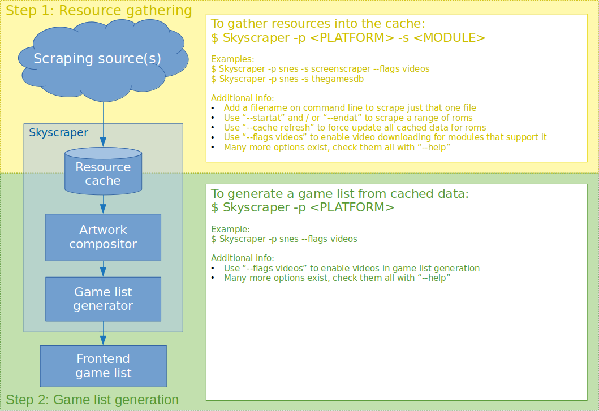

## A Typical Skyscraper Usecase

The following describes a typical way of using Skyscraper. It's really simple to use once you understand the core concept. It has a couple of layers you should familiarize yourself with in order to get the best results.

!!! info 

    Always remember to close your frontend before using Skyscraper! Otherwise any game list generated by Skyscraper will be overwritten when you exit the frontend.

!!! info 

    Some of the scraping modules either require or work best when you have registered a user with their service and configured Skyscraper to make use of these credentials when scraping with the module. The suggested `screenscraper` source used in the command a bit further down will work without credentials. But when the service is busy, it will give you an error! So consider registering users with the relevant sources and configure Skyscraper to make use of them. Read about all scraping modules [here](SCRAPINGMODULES.md).

Now, let's dig in!

### You Have Some Files but no Information

You probably installed Skyscraper in order to get some data and artwork on your frontend game lists. So let's say that you have a bunch of Super Nintendo files you wish to populate with data. You'd first gather some data into the Skyscraper resource cache and then generate a game list using the cached data afterwards. So it's a two-step process.



#### The Gathering Phase

Skyscraper can gather data from several scraping modules / sources (set with `-s <MODULE>`). So you'd start by scraping the `snes` platform (set with `-p <PLATFORM>`) with one or more of those modules. Each time you do so, all of the data will be saved in the Skyscraper cache.

```
$ Skyscraper -p snes -s screenscraper
```

This should have given you a lot of data for your games. But some of it might still be missing. So let's continue gathering some data from another module.

```
$ Skyscraper -p snes -s thegamesdb
```

Each time you scrape your roms with a new scraping module, all of the data that was gathered will be cached inside Skyscraper's internal resource cache. The cache can contain one of each resource for each of the scraping modules.

#### The Game List Generation Phase

By having gathered data from both sources (`screenscraper` _and_ `thegamesdb`) there's a good chance that you will get a complete result if the data from both is combined. And that's _exactly_ what Skyscraper can do for you.

```
$ Skyscraper -p snes
```

Running that command will generate a game list for the chosen frontend (default is EmulationStation). It combines all of the cached data into the most complete results. This phase also includes the artwork compositing. If you use a non-default frontend, you can configure this in Skyscraper's configuration as described [here](CONFIGINI.md#frontend). Or you can set it on command-line as described [here](CLIHELP.md#-f-frontend).

The source priority for each resource is defined per-platform and can be changed at any time. Read more about that [here](CACHE.md#resource-and-scraping-module-priorities).

### So What Then?

You're done! The game list has been generated and you can relaunch your frontend to enjoy the game data and artwork. Or you can move on and scrape data for another platform. Just remember to distinguish between the _gathering_ phase and the _game list generation_ phase. Always gather first, then generate the game list afterwards.

!!! tip

    You can always re-generate a game list if you changed the artwork configuration or gathered new data for any of your roms. Simply rerun the `Skyscraper -p <PLATFORM>` command again, and the game list will be re-generated with your new settings using all of the previously cached data.

!!! tip

    If you re-gather data for a platform, it will skip games that already have data in the resource cache to save bandwidth for the online sources. To force a refresh of the data directly from the source, you need to set the `--refresh` option.

### But What About...

Yes, yes, yes. This is just the basics. You can customize the artwork completely to your liking. You can prioritize the different cached resources any way you like. You can scrape single games in order to gather information for just that one game. You can enable video scraping. You can import your own data into the cache. You can edit the cached data. You can clean your cache. You can create aliases for games that are difficult to scrape. You can change your preferred region and language for the modules that support it. You can set up keys or user id's and password for the scraping modules that take advantage of this. There's _a lot_ you can do if you want to.

The important thing to note is that the defaults for Skyscraper is set to work well for most users. So unless you see something you want to change, you don't have to. But it's equally important to know that you _can_.

If this piqued your interest, please read the entire documentation thorougly. Everything is documented to the last detail. It can seem overwhelming. But it gives you some really powerful options to scrape just the way you want. Read more about the advanced features [here](https://github.com/Gemba/skyscraper/blob/master/README.md#a-quick-run-down-of-skyscraper)
